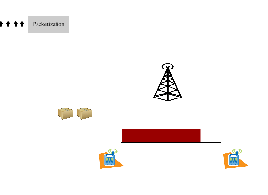

# Cognitive Radio Network Queueing simulator
CRN is a free, open-source, simulator designed to calculate different queueing parameters such as waiting time service time for a cognitive radio network frame work.([webpage](http://alivalehi.com/crn))


CRN is ideal for modeling packeting symbols which are generated from different sensors. It has a user friendly interface with the users for adjusting the channel paramters. The basic usage of the CRN is caluclating mean waiting time and service time with different methods of input generation and packetization 

###### NFsim code is freely available under the GNU GENERAL PUBLIC LICENSE Version 3 on github: 
[CRN source files](https://github.com/alivalehi/crn)

* To get CRN now, You can click on the download links which are available in the left menue.

* To learn more about how to use CRN, visit the Documentaion page which is accessible from the link in the left menue.


 * ##### Questions, concerns, and comments should be directed to Ali Valehi ali.valehi@gmail.com or Abolfazl Razi abolfazl.razi@nau.edu.

Following is the list of projects which is developed based on this package:
 
 
* An Online Learning Method to Maximize Energy Efficiency of Cognitive Sensor Networks [IEEE](http://ieeexplore.ieee.org/document/8294225/) 
[Bibtex] (http://alivalehi.com/crn/wcncpapermay17bibtex.cite)

* Maximizing Energy Efficiency of Cognitive Wireless Sensor Networks With Constrained Age of Information[IEEE](http://ieeexplore.ieee.org/document/8025774/)
* Delay Minimization by Adaptive Framing Policy in Cognitive Sensor Networks [IEEE](http://ieeexplore.ieee.org/document/7925727/)

Please cite CRN as:
```
A. Valehi and A. Razi, "Maximizing Energy Efficiency of Cognitive Wireless Sensor Networks With Constrained Age of Information," in IEEE Transactions on Cognitive Communications and Networking, vol. 3, no. 4, pp. 643-654, Dec. 2017.
doi: 10.1109/TCCN.2017.2749232
```
