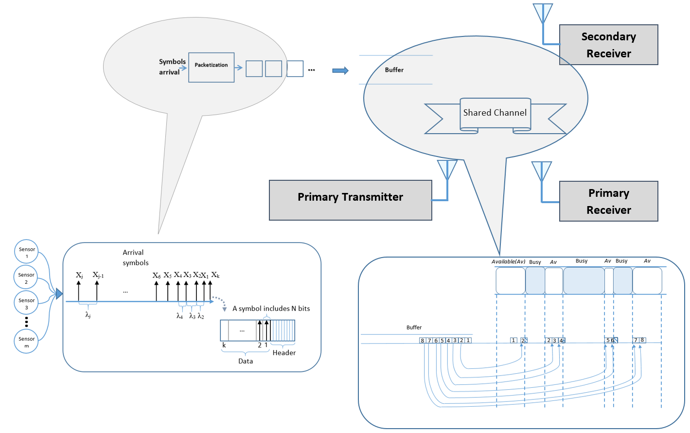
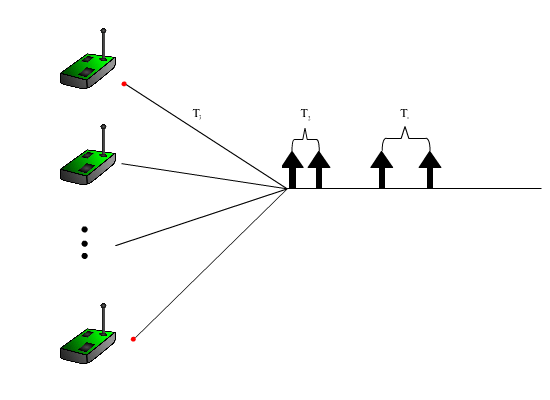
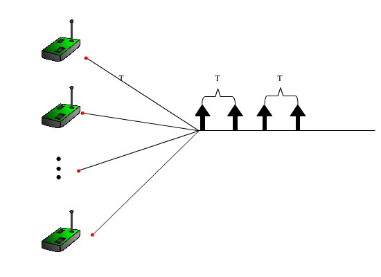
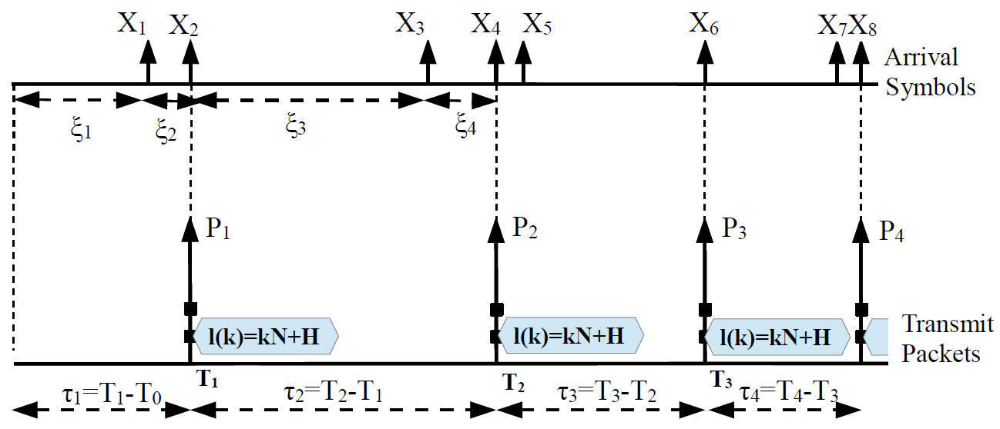

# CRN-Queueing
CRN-queueing package is a tool for simulating the behaviour of packets in cognitive radio network or cognitive radio sensor networks. The aim of this package is calculating different features of such a system in addition to many other objectives which can be add to its framework. 

 The package includes following main cores.
 1- simulator initializer
 1- simulation parameter calculator
 1- symbol generator
 1- packetizer
 1- channel generator
 1- paket transmission simulator
 In order to understand how each of these cores participate in the simulation a sample (sample.m) is provided which utilize all of these  cores to simulate a CRN with single pair of users.
 Following is the description of sample exmaple:
 # Sample model
The code starts with following code. 
```
user_input   = 0;   % Wether ask user for initialization (1) or run with default setting (0)
framing_flag = 0;   % Framing type flag
TK_flag      = 0;   % Framing type flag
Ber_flag     = 0;   % Bit error rate flag
Rch_flag     = 0;   % Channel processing rate flag
lambda_flag  = 0;   % Input rate flag
input_flag   = 0;   % Input type flag
```
These lines are used to define some flags to make sure that the parameters that we are going to ask from a user completely gathered.

After making sure that the interface has this ability to completely asks for the required information we start asking users different questions to make sure that configure the system accordingly.Following section is for getting data from users.  Users are being asked to provide values for the simulation for example type of framing type of input process....

```matlab
while input_flag ==0
     display('What typr of input process you want to choose for this simulation? 
     Please insert 1 for Poisson or 2 for       Deterministic');
     x = input('','s');
     if (x=='1' || x=='2')
          input_flag = 1;
     end
     if (x=='1')
          display('Poisson is choosen');
          sim.input_process = 1;
      end
      if (x=='2')
          display('Deterministic is choosen');
          sim.input_process = 2;
      end
 end
 ```
    
### Input process
The first question is about input process there are two different types of input process has beeen defined in CRN. Posission and Deterministic
* #### Poission
As you can see in the following figure the samples are generated according to poission process in the other words the time between generation of each symbol (shown by arrow) To know more about the realtion of Possion and exponential you can check [this link](https://stats.stackexchange.com/questions/2092/relationship-between-poisson-and-exponential-distribution). 



* #### Deterministic
Another type of symbol generation is deterministic intervals. Although, this assumption is not that much real and it  is not a good approximation  for such a system. It is included in the package!
In the following figure this concept is illistrated. The deteministic symbol generation can be also be described in this context:we assume that symbols are generated in a constant rate therefore the interval between all symbols has an equal length. 

```matlab
while lambda_flag == 0
     display('What is the lambda for the input generation?');
     y = input('');
     if(isnumeric(y))
          sim.lambda  = y;
          lambda_flag = 1;
     end
end
```
After we accept the type of input process the next step would be the parametr for the choosen distribution of inputs inteval. Therefore the lambda as variable will initialize as parametr of the exponential distribution or deterministic distribution.

### Framing mode
In this section of the example framing mode is selected b a user. There two different type of framing defined in the current version of the ""Number based and Time based.
```matlab    
while framing_flag ==0
     display('What kind of Framing mode you want to choose for this simulation?
     Please insert 1 for Time based or 2 for Number based');
     x = input('','s');
     if (x=='1' || x=='2')
          framing_flag=1;
     end
     if (x=='1')
          display('Time based method is choosen');
          sim.Framing_mode = 1;
     end
     if (x=='2')
          display('Number based method is choosen');
          sim.Framing_mode = 2;
     end
     mode = sim.Framing_mode; 
end
    
while TK_flag ==0
     if (x=='1')
          display('In how many seconds you want to packetize your symbols?');
          y = input('');
          if(isnumeric(y))
               TK_flag =1;
               T = y;
          end
      end
      if (x=='2')
           display('Please specify number of symbols in each packet?');
           y = input('');
           if(isnumeric(y))
                TK_flag =1;
                K = y;
           end
      end
end
```

* #### Number Based
A sequence of N-bit measurement samples is generated by each sensing module according to a Poisson process with rate lambda. Therefore, the sample interarrival times, denoted by xi_j are independent and exponentially distributed random variable with mean 1/lambda. 
Each measurement sample is quantized and digitized to an N-bit value. Under the developed Number-based framing policy, each sensor waits for genesis of k samples {X_{k(i-1)+1},X_{k(i-1)+2},...,X_{ki}} and then encapsulates them into a single packet P_i . For a constant header size of H, the length of packets is a function of k: l(k)=kN+H. 



* #### Time Based 
A sequence of N-bit symbols arrives at the input of transmission system according to a Poisson process with rate lambda. 
The symbols are combined into packets with a constant header size H, then scheduled in an infinite length queue with FCFS discipline and transmitted through a wireless channel with bit rate  R to the destination. 
In order to bundle the symbols into the transmit packets, we adopt a time-based packetization policy, where the time axis is partitioned into consecutive equal packetization intervals of size T. The {k}_n symbols that arrive at the n^{th} interval [(n-1)T, nT)={t|(n-1)T <= t < nT are combined to form a single transmission packet X_n and is scheduled for transmission.

```matlab 
while Rch_flag ==0
     display('What is the rate of channel?');
     y = input('');
     if(isnumeric(y))
          sim.ch.Rch =y;
          Rch_flag =1;
     end
end
while Ber_flag ==0
     display('What is the channel bit error rate?');
     y = input('');
     if(isnumeric(y))
          sim.ch.BER=y;
          Ber_flag =1;
      end
end
```
### Default settings
Following block contains all of the default setting for the imulation

```
else
    mode              = 1;   %1 for Time based or 2 for Number based
    sim = init_sim(mode);
    sim.input_process = 1;   %1 for Poisson  2 for Deterministic
    sim.lambda        = 100;
    sim.Framing_mode  = mode;
    sim.ch.BER        = 1e-4;
    K                 = 10;
    sim.ch.Rch        = 500;
```
Some initialization that in this sample code is not initialized by the user
```
sim.cognitive = 1;
sim.control.debug_active = 0;
```
### Simulation process
The actual simulation start from this section
```matlab
%Find all the simulation parameters from the given simulation parameters [calc_sim_params]
sim = calc_sim_params(sim);
%Setting up H,N,lambda,a=1/lambda,Kv
H = sim.H;  N = sim.N; lambda = sim.lambda;  a=1/lambda;
if (sim.input_process == 1)              %Poisson process with rate 1/a,
    int_arrivals = random('exp', a,[1,sim.run.Nsym;]);   %generate interarrival times
elseif (sim.input_process == 2)          %Deterministic inputs
    int_arrivals = a * ones (1,sim.run.Nsym);           %interarrival times are constant
end
t=clock;
fprintf('\n\n***********************************************************************************\n');
fprintf(' Date:%d-%d-%d   Time: %d:%d \n', floor(t(1:5)));
fprintf('***********************************************************************************\n');
if sim.Framing_mode==1
    [tp, kp, fiv] = f_perform_framing(sim.Framing_mode, int_arrivals, T, sim.control.debug_active);
else
    [tp, kp, fiv] = f_perform_framing(sim.Framing_mode, int_arrivals, K, sim.control.debug_active);
end
display('The packetization has been done!');
queue.tp=tp; queue.kp=kp;
[queue] = f_q_evolution(queue, sim, 1);
te=clock;
delay = mean(queue.wnv + queue.sv);
  if sim.cognitive, fprintf('COGNITIVE Results ServiceTime[%f]   WaitingTime[%f]  Delay[%f] \n', ...
                mean(queue.sv),mean(queue.wnv), delay);    end

 catch
display('!!!!!!!!!!!!It seems you did not follow the requested format for the inputs please try agian!!!!!!!!!!!!')
end

```
In The simulation process we first call the function "calc_sim_params" which calculates some of the simulation parameters as follows:
##### Inputs:
* symbol process rate
* Minimum packetization interval: Tmin
* PER
* Packetization time vector: Tv

##### Outputs:
* symbol process average interarrival time
* Average packetization interval = 2 * Tmin
* BER
* Average packet length
* Channel Rate

Next according to the users selection or the default settings symbols inter-arrivals are generated and the variable "int_arrivals" is initialized.

Next packets are formed according to the framing methods and parameter by calling the function "f_perform_framing". This function works as follows:

##### Inputs: 
* Framing mode: 0:Frame based packetization, 1:Time based packetization 
* x: inter-arrival times
* TK: Framing time for time-based based packetization policy or Number of symbols at each packet for number-based packetization 

##### Outputs:
* tp: time of the end of each packetization interval 
* kp: number of symbols in each interval

Finally all of the calculated variables send to the queue simulator by calling "f_q_evolution" and the result of smulation shown as mean of waiting time and service time


